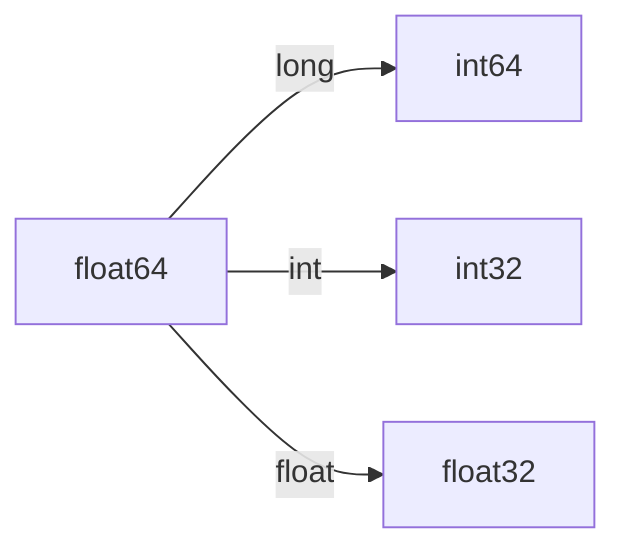

# **张量**


> 索引笔记

1.<a href="#1">什么是张量?</a>

2.<a href="#2">张量的数据类型</a>

3.<a href="#3">张量的生成</a>

4.<a herf="#4"> 张量的操作 </a>

5.<a herf="#5"> 张量的计算 </a>

---


## 什么是张量?


​		在数学中,一个单独的数可以称为**标量**,一列或者一行数组可以称为**向量**,一个二维数组称为**矩阵**,矩阵中每一个元素可以被行和列的索引唯一确定.**那么张量就是数组的维度超过2,便可以称为:张量**.

​	 :warning:**请注意:这是张量在数学中的解释,Pytorch是与此不同的解释.**  :warning:

​	 :star:  **==在Pytorch中,张量属于一种数据结构,它可以是一个标量、一个向量、一个矩阵,甚至是更高维度的数组.在神经网络中,基于Pytorch的相关计算和优化都是在Tensor上完成的.==**


## 张量的数据类型


### 类型介绍

在Torch中,CPU和GPU版本分别都有8种不同的数据类型.

CPU版本和GPU版本在Tensor的命名规则有不同:

如：

​		CPU版本: torch.IntTensor 

则GPU应为:

​		GPU版本:torch.cuda.IntTensor


|     数据类型     |             Dtype             |     CPU TenSor     |       GPU TenSor        |
| :--------------: | :---------------------------: | :----------------: | :---------------------: |
| 32位浮点型(默认) | torch.float32 \| torch.float  | torch.FloatTensor  | torch.cuda.FloatTensor  |
|    64位浮点型    | torch.float64 \| torch.double | torch.DoubleTensor | torch.cuda.DoubleTensor |
|    16位浮点型    |  torch.float16 \| torch.half  |  torch.HalfTensor  |  torch.cuda.HalfTensor  |
|  8位无符号整型   |          torch.uint8          |  torch.ByteTensor  |  torch.cuda.ByteTensor  |
|  8位有符号整型   |          torch.int8           |  torch.CharTensor  |  torch.cuda.CharTensor  |
|  16位有符号整型  |  torch.int16 \| torch.Short   | torch.ShortTensor  | torch.cuda.ShortTensor  |
|  32位有符号整型  |   torch.int32 \| torch.Int    |  torch.IntTensor   |  torch.cuda.IntTensor   |
|  64位有符号整型  |   torch.int64 \| torch.long   |  torch.LongTensor  |  torch.cuda.LongTensor  |


​		在了解了Torch各类型的命名规则后,请记住:Torch 默认的数据类型为:32位浮点型(Dtype: torch.FloatTensor),若想重新设置默认的数据类型,请使用函数: `torch.set_default_tensor_type(你想设置的类型)` . :palestinian_territories: : 该函数只支持设置浮点型

​	

###  代码演示

#### 查看Tensor类型

---

```python
torch.tensor([1.2, 3.4]).dtype
```

输出内容: `torch.float32`


#### 设置Torch默认的数据类型

---

```python
torch.set.default.tensor_type(torch.DoubleTensor)
```

输出内容: `torch.float64`


#### 将张量数据类型换成整型

将`torch.tensor([1.2 , 3.4])`类型位为:torch.float64 转换成其他类型


1. 使用 ?.long()方法可以将类型转换为:64为有符号整型
2. 使用 ?.int()方法可以将类型转换为：32位有符号整型
3. 使用 ?.float()方法可以将类型转换位:32位浮点型(torch默认)


```python
import torch

torch.set_default_tensor_type(torch.DoubleTensor)
a = torch.tensor([1.2, 3.4])
print("张量 A 的数据类型为", a.dtype)
print("将张量 A 的数据类型修改为int64位", a.long().dtype)
print("将张量 A 的数据类型修改位int32位", a.int().dtype)
print("将张量 A 的数据类型修改为float类型", a.float().dtype)

torch.set_default_tensor_type(torch.FloatTensor)
print("将原来的张量的数据类型修改回去", torch.tensor([1.2, 3.4]).dtype)

print("查看默认的数据类型", torch.get_default_dtype())
```


#### 恢复为torch默认的数据类型

---

再次使用`torch.set_default.tensor_type(torch.FloatTensor)`即可

或者使用`torch.get_default.dtype()`


## 张量的生成

​			***下面的示例将以多种不同的方式生成深度学习需要的张量***

#### 使用`torch.tensor()`函数生成

```python
A = torch.tensor([1.0, 1.0],[2, 2])
```

##### 获取张量的信息

###### 如要获取张量的**维度**，可以使用`A.shape()`

​	输出:`torch.Size([2,2])`

###### 如要获取张量的形状大小，可以使用`A.size()`

​	输出:`torch.size([2,2])`

###### 如要获取张量中包含的元素个数，可以使用`A.numel()`

​	输出:`4`

```python
import torch

# 构建一个 5 X 3 未初始化的矩阵
x = torch.empty(5, 3)
print(x)

A = torch.tensor([[1, 1], [2, 3], [3, 3]])  # 手动定义张量中每一个元素的值
print(A)
print("获取张量的维度", A.shape)  # 输出张量有几行几列
print("获取张量的形状大小", A.size())  # 输出张量形态大小
print("获取张量元素个数", A.numel())  # 输出张量元素的个数

#  在创建Terson可以在dtype中指定张量的数据类型,参数requires_grad可以用来指定张量是否需要计算梯度
B = torch.Tensor((1, 2, 3), dtype=torch.float32, requires_grad=True)


```


#### 使用`torch.Tensor()`函数生成张量

1.我们可以通过已经有的数据生成张量

```python
C = torch.Tensor([1,2,3,4])
```

输出:`tensor([1,2,3,4])`


2. 通过创建特点尺寸的张量

```python
D = torch.Tensor(2,3)
```

输出:`tensor([[0., 0., 0.],[0., 0., 0.]])`

---

#### 随机数生成张量

使用`torch.normal()`生成服从正态(0，1)分布的随机数

```python
A = torch.normal(mean=0.0, std=torch.tensor(1.0))
print(A)
```

输出：`tensor(1.2248)`

函数参数解释:`mean`参数指定**随机数的均值**,`std`参数指定**随机数的标准差**

如果mean和std只有一个元素则只会生成一个随机数；如果mean参数和std参数有多个值，则可以生成多个随机数


```python
A = torch.normal(mean=0.0, std=torch.arange(1, 5.0))
```

输出:`tensor([ 0.2510, -0.2595,  2.4206,  4.9783])`

---

##### 使用`torch.rand()`函数生成随机数张量

```python
A = torch.rand(5, 5)
print(A)
```

输出:`tensor([[0.9053, 0.2851, 0.8148, 0.3081, 0.0115],
        [0.4860, 0.1522, 0.7580, 0.8376, 0.7817],
        [0.6003, 0.5701, 0.2243, 0.5357, 0.0379],
        [0.0331, 0.7724, 0.5676, 0.5962, 0.3242],
        [0.2738, 0.7012, 0.6589, 0.3556, 0.3668]])`

==此函数生成的随机数区间为:0-1==

---

##### 使用`torch.randlike`可生成与指定张量维度相同的随机张量

```python
B = torch.ones(2, 3)
C = torch.rand_like(B)
print(C)
```

输出:`tensor([[0.7671, 0.2962, 0.9839],
        [0.2845, 0.5208, 0.4297]])`

---

使用`torch.randperm(n)`可将0~n之间的整数进行随机排序输出

```
print(torch.randperm(20))
```

输出:`tensor([ 1,  2, 18,  9,  0, 14,  7, 13, 19, 16,  3, 15, 10,  6,  4, 17,  5,  8, 11, 12])`

---

##### 生成其他类型的张量

###### 使用`torch.arange`生成Tensor(递增、递减)规则

```python
A = torch.arange(start=0, end=20, step=5)
print(A)
```

输出:`tensor([ 0,  5, 10, 15])`

参数解释:`start`指定从开始的数值,`end`指定结束数值,`step`指定步长

----

###### 使用`torch.linspace`生成在范围固定数量的间隔Tensor

```python
A = torch.linspace(start=0, end=20, steps=10)
print(A)
```

输出:`tensor([ 0.0000,  2.2222,  4.4444,  6.6667,  8.8889, 11.1111, 13.3333, 15.5556,17.7778, 20.0000])`

---

##### 生成Tensor系列函数

|                 函数                 |       描述        |
| :----------------------------------: | :---------------: |
|          torch.zeros(3, 3)           |  3x3的全O Tensor  |
|             torch.eye(3)             | 3x3的单位 Tensor  |
| torch.full((3, 3),fill_value = 0.25) | 3x3使用全0.25填充 |
|          torch.empty(3, 3)           |    3x3空Tensor    |


---

#### 使用`torch.??_like()系列`函数生成与指定张量维度相同,性质相似的张量

生成上述Tensor D`同维度、性质的全1`向量

```python
torch.ones_like(D)
```

输出:`tensor([[1., 1., 1.],[1., 1., 1.]])`


##### 使用`torch.zeros_like()`函数生成一个于D维度相同的*全0张量*

```
torch.zeros_like(D)
```

输出:`tensor([[0., 0., 0.],[0., 0., 0.]])`


##### 使用`torch.rand_like()`函数生成与D维度相同的*随机张量*

```python
torch.rand_like(D)
```

输出:`tensor([[0.1108, 0.0518, 0.4455],[0.6217, 0.2030, 0.0051]])`


##### 使用`torch.new_tensor()`创建一个数据类型相识,但*尺寸不同的张量*

```python
E = [[1, 2], [3, 4]]
E = D.new_tensor(E)
print(E)
print(E.dtype)
```

输出：`tensor([[1., 2.],[3., 4.]])
	   torch.float32`

##### `?.new_??()系列`函数

|               函数               |           描述           |
| :------------------------------: | :----------------------: |
| ?.new_full((3,3),full_value = 1) | 尺寸为3x3使用1填充的张量 |
|        ?.new_zeros((3,3))        |    尺寸为3x3的全0张量    |
|        ?.new_empty((3,3))        |    尺寸3x3的全空张量     |
|        ?.new_ones((3,3))         |     尺寸3x3的全1张量     |


#### 张量和Numpy数据互相转换

##### 将Numpy数组转换为张量

1.将张量转换为Numpy数组,在通过对Numpy数组进行相关计算后,可再次转换为张量

函数：`torch.as_tensor()` 和 `torch.from_numpy()`

`torch.as_tensor()转换`

```python
import torch
import numpy as np

F = np.ones((3, 3))
## 使用torch.as_tensor()
Ftensor = torch.as_tensor(F)
print(Ftensor)
```

输出:`tensor([[1., 1., 1.],[1., 1., 1.],[1., 1., 1.]], dtype=torch.float64)`

---

`torch.from_numpy()`转换

```python
import torch
import numpy as np

Ftensor = torch.from_numpy(F)
print(Ftensor)
```

输出:`tensor([[1., 1., 1.],[1., 1., 1.],[1., 1., 1.]], dtype=torch.float64)`


==注意:在这两个函数转换得到的Tensor是float64数据类型的,因为使用Numpy生成的数组类型默认是float64位浮点类型==

---

##### 张量转为Numpy数组

##### 使用`torch.numpy()`函数转换

```python
Ftensor.numpy()
```

输出:`[[1. 1. 1.] [1. 1. 1.][1. 1. 1.]]`

---


### 附加生成参数

###### dtype指定Tensor的数据类型

在生成的构建语句中,加入`dtype`可以生成指定数据类型的Tensor

​	`B = torch.Tensor((1, 2, 3),dtype = torch.float32)`

上述语句构建出一个 **float32** 数据类型的**Tensor B**

---

###### requires指定Tensor是否需要计算精度

​    `B = torch.Tensor((1, 2, 3),dtype = torch.float32,requies = true) `


## 张量的计算

​	在上述代码中,我们构建了一个数据类型为float32,且支持计算梯度.那我们可以尝试下**一些Tensor**计算

​	对于函数: `y=3x2+2x` 可化简为:y′=6x+2,当x=2时,y′=14  

了解题目torch求解为:

​	

```python
import torch

#  在创建Terson可以在dtype中指定张量的数据类型,参数requires_grad可以用来指定张量是否需要计算梯度
x = torch.tensor([2], dtype=torch.float, requires_grad=True)
y = 3 * torch.pow(x, 2) + 2 * x
y.backward()
print(x.grad)  # 3*(2*x)+2=14
```

输出为:`tensor([14.])`


   很显然这不能帮助我们快速理解代码,我们再换一个: 3 * (x + 2)

​	

```python
import torch

U = torch.tensor((1, 2, 3), dtype=torch.float32, requires_grad=True)
i = 3 * U.pow(2).sum()
i.backward()
print(U.grad)

```

输出为: `tensor([ 6., 12., 18.])`


注意:只有数据类型是浮点类型的Tensor才允许计算梯度


## 张量操作

​		==在生成张量后,我们往往需要对张量进行一系列的操作.如改变张量的形状、获取或改变张量中的标量、将张量进行拼接和拆减==

### 改变张量的形状

针对不同的情况对Tensor形状尺寸有多种函数和方法可以选

#### `torch.reshape()`函数设置形状大小

为了清楚了解此函数我们先生成一个0~11的Tensor

```python
print(torch.arange(12.0))
```

输出:`tensor([ 0.,  1.,  2.,  3.,  4.,  5.,  6.,  7.,  8.,  9., 10., 11.])`

***开始改变形状、大小***

```python
A = torch.arange(12.0).reshape(3, 4)
print(A)
```

输出:`tensor([[ 0.,  1.,  2.,  3.],[ 4.,  5.,  6.,  7.],[ 8.,  9., 10., 11.]])`

现在我们可以清楚的看到:使用reshape(行，列)函数将1x11的Tensor变为一个3x4的Tensor


<u>除了可以在生成Tensor修改形状、大小，也可以在输入的时候修改Tensor形状、大小</u>

```python
print(torch.reshape(input=A, shape=(2, -1)))
```

输出:`tensor([[ 0.,  1.,  2.,  3.,  4.,  5.],[ 6.,  7.,  8.,  9., 10., 11.]])`

现在通过在输入时修改原来生成的A Tensor,由原来的3X4被修改为:2 x 6(-1为自动控制列)


#### 生成\输入改变`torch.resize_()`

```python
A = torch.arange(24.0).reshape(12, 2)
A.resize_(4, 6)
print(A)
```

输出:`tensor([[ 0.,  1.,  2.,  3.,  4.,  5.],
        [ 6.,  7.,  8.,  9., 10., 11.],
        [12., 13., 14., 15., 16., 17.],
        [18., 19., 20., 21., 22., 23.]])`


`torch.resize_as_()`函数可以把形状修改和指定Tensor相似

```python
B = torch.empty(5, 5)
A.resize_as_(B)
print(A)
```

输出:`tensor([[0.0000e+00, 1.0000e+00, 2.0000e+00, 3.0000e+00, 4.0000e+00],
        [5.0000e+00, 6.0000e+00, 7.0000e+00, 8.0000e+00, 9.0000e+00],
        [1.0000e+01, 1.1000e+01, 1.2000e+01, 1.3000e+01, 1.4000e+01],
        [1.5000e+01, 1.6000e+01, 1.7000e+01, 1.8000e+01, 1.9000e+01],
        [2.0000e+01, 2.1000e+01, 2.2000e+01, 2.3000e+01, 1.4013e-45]])`

#### 插入\移除新的维度以得到一个提升的维度

##### 插入一个新的维度`torch.unsqueeze`

```python
A = torch.arange(24).reshape(4, 6)
print(A)
B = torch.unsqueeze(A, dim=0)
print(B.shape)
```

输出:`tensor([[ 0,  1,  2,  3,  4,  5],
        [ 6,  7,  8,  9, 10, 11],
        [12, 13, 14, 15, 16, 17],
        [18, 19, 20, 21, 22, 23]])
	  torch.Size([1, 4, 6])`

==现在可以看到在Tensor A维度为:4,6的0号维度又新增了一个维度,维度由二维展开至三维.==


##### 移除一个维度`torch.squeeze`

```python
C = torch.squeeze(A, dim=0)
print(C.shape)
```

输出:`torch.Size([4, 6])`

在原来的B的基础上,我们又通过移除维度恢复为原来的4x6的二维Tensor


#### 张量维度拓展

##### `.expand()`对张量的形状大小进行修改

```python
A = torch.arange(3)
print(A)
B = A.expand(3, -1)
print(B)
```

输出:`tensor([0, 1, 2])
	  tensor([[0, 1, 2],
        [0, 1, 2],
        [0, 1, 2]])`

##### `.expand_as(C)`可以让张量根据C的形状大小进行拓展得到一个新的张量

