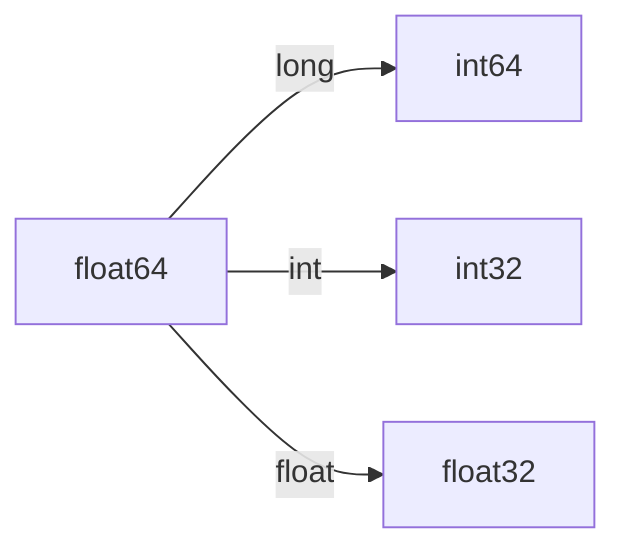

# **张量**


> 索引笔记

1.<a href="#1">什么是张量?</a>

2.<a href="#2">张量的数据类型</a>

3.<a href="#3">张量的生成</a>

4.<a herf="#4"> 张量的操作 </a>

---


## 什么是张量?


​		在数学中,一个单独的数可以称为**标量**,一列或者一行数组可以称为**向量**,一个二维数组称为**矩阵**,矩阵中每一个元素可以被行和列的索引唯一确定.**那么张量就是数组的维度超过2,便可以称为:张量**.

​	 :warning:**请注意:这是张量在数学中的解释,Pytorch是与此不同的解释.**  :warning:

​	 :star:  **==在Pytorch中,张量属于一种数据结构,它可以是一个标量、一个向量、一个矩阵,甚至是更高维度的数组.在神经网络中,基于Pytorch的相关计算和优化都是在Tensor上完成的.==**


## 张量的数据类型


### 类型介绍

在Torch中,CPU和GPU版本分别都有8种不同的数据类型.

CPU版本和GPU版本在Tensor的命名规则有不同:

如：

​		CPU版本: torch.IntTensor 

则GPU应为:

​		GPU版本:torch.cuda.IntTensor


|     数据类型     |             Dtype             |     CPU TenSor     |       GPU TenSor        |
| :--------------: | :---------------------------: | :----------------: | :---------------------: |
| 32位浮点型(默认) | torch.float32 \| torch.float  | torch.FloatTensor  | torch.cuda.FloatTensor  |
|    64位浮点型    | torch.float64 \| torch.double | torch.DoubleTensor | torch.cuda.DoubleTensor |
|    16位浮点型    |  torch.float16 \| torch.half  |  torch.HalfTensor  |  torch.cuda.HalfTensor  |
|  8位无符号整型   |          torch.uint8          |  torch.ByteTensor  |  torch.cuda.ByteTensor  |
|  8位有符号整型   |          torch.int8           |  torch.CharTensor  |  torch.cuda.CharTensor  |
|  16位有符号整型  |  torch.int16 \| torch.Short   | torch.ShortTensor  | torch.cuda.ShortTensor  |
|  32位有符号整型  |   torch.int32 \| torch.Int    |  torch.IntTensor   |  torch.cuda.IntTensor   |
|  64位有符号整型  |   torch.int64 \| torch.long   |  torch.LongTensor  |  torch.cuda.LongTensor  |


​		在了解了Torch各类型的命名规则后,请记住:Torch 默认的数据类型为:32位浮点型(Dtype: torch.FloatTensor),若想重新设置默认的数据类型,请使用函数: `torch.set_default_tensor_type(你想设置的类型)` . :palestinian_territories: : 该函数只支持设置浮点型

​	

###  代码演示

#### 查看Tensor类型

---

```python
torch.tensor([1.2, 3.4]).dtype
```

输出内容: `torch.float32`


#### 设置Torch默认的数据类型

---

```python
torch.set.default.tensor_type(torch.DoubleTensor)
```

输出内容: `torch.float64`


#### 将张量数据类型换成整型

将`torch.tensor([1.2 , 3.4])`类型位为:torch.float64 转换成其他类型


1. 使用 ?.long()方法可以将类型转换为:64为有符号整型
2. 使用 ?.int()方法可以将类型转换为：32位有符号整型
3. 使用 ?.float()方法可以将类型转换位:32位浮点型(torch默认)


```python
import torch

torch.set_default_tensor_type(torch.DoubleTensor)
a = torch.tensor([1.2, 3.4])
print("张量 A 的数据类型为", a.dtype)
print("将张量 A 的数据类型修改为int64位", a.long().dtype)
print("将张量 A 的数据类型修改位int32位", a.int().dtype)
print("将张量 A 的数据类型修改为float类型", a.float().dtype)

torch.set_default_tensor_type(torch.FloatTensor)
print("将原来的张量的数据类型修改回去", torch.tensor([1.2, 3.4]).dtype)

print("查看默认的数据类型", torch.get_default_dtype())
```


#### 恢复为torch默认的数据类型

---

再次使用`torch.set_default.tensor_type(torch.FloatTensor)`即可

或者使用`torch.get_default.dtype()`


### 张量的生成

​			***下面的示例将以多种不同的方式生成深度学习需要的张量***

#### 使用`torch.tensor()`函数生成

```python
A = torch.tensor([1.0, 1.0],[2, 2])
```

##### 获取张量的信息

###### 如要获取张量的**维度**，可以使用`A.shape()`

​	输出:`torch.Size([2,2])`

###### 如要获取张量的形状大小，可以使用`A.size()`

​	输出:`torch.size([2,2])`

###### 如要获取张量中包含的元素个数，可以使用`A.numel()`

​	输出:`4`

```python
import torch

# 构建一个 5 X 3 未初始化的矩阵
x = torch.empty(5, 3)
print(x)

A = torch.tensor([[1, 1], [2, 3], [3, 3]])  # 手动定义张量中每一个元素的值
print(A)
print("获取张量的维度", A.shape)  # 输出张量有几行几列
print("获取张量的形状大小", A.size())  # 输出张量形态大小
print("获取张量元素个数", A.numel())  # 输出张量元素的个数

#  在创建Terson可以在dtype中指定张量的数据类型,参数requires_grad可以用来指定张量是否需要计算梯度
B = torch.Tensor((1, 2, 3), dtype=torch.float32, requires_grad=True)


```


##### 附加生成参数

###### dtype指定Tensor的数据类型

在生成的构建语句中,加入`dtype`可以生成指定数据类型的Tensor

​	`B = torch.Tensor((1, 2, 3),dtype = torch.float32)`

上述语句构建出一个 **float32** 数据类型的**Tensor B**

---

###### requires指定Tensor是否需要计算精度

​    `B = torch.Tensor((1, 2, 3),dtype = torch.float32,requies = true) `


###### 一个简单的Tensor计算

​	在上述代码中,我们构建了一个数据类型为float32,且支持计算梯度.那我们可以尝试下**一些Tensor**计算

​	对于函数: `y=3x2+2x` 可化简为:y′=6x+2,当x=2时,y′=14  

了解题目torch求解为:

​	

```python
import torch

#  在创建Terson可以在dtype中指定张量的数据类型,参数requires_grad可以用来指定张量是否需要计算梯度
x = torch.tensor([2], dtype=torch.float, requires_grad=True)
y = 3 * torch.pow(x, 2) + 2 * x
y.backward()
print(x.grad)  # 3*(2*x)+2=14
```

输出为:`tensor([14.])`


   很显然这不能帮助我们快速理解代码,我们再换一个: 3 * (x + 2)

​	

```python
import torch

U = torch.tensor((1, 2, 3), dtype=torch.float32, requires_grad=True)
i = 3 * U.pow(2).sum()
i.backward()
print(U.grad)

```

输出为: `tensor([ 6., 12., 18.])`


